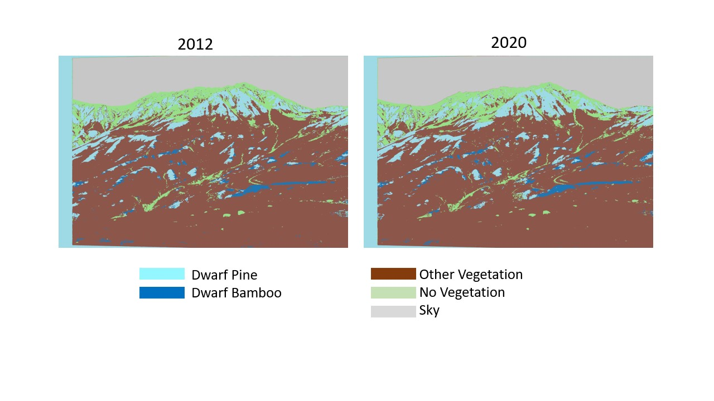

```{r setup, include=FALSE}
library(tidyverse)
library(magrittr)
library(gtsummary)
library(kableExtra)
translate_classes <- function(names) {
  res = c()
  for (i in 1:length(names)) {
    res[i] <- 
      switch (names[i],
              "コケモモ-ハイマツ群集" = "Dwarf Pine",
              "ササ群落" = "Dwarf Bamboo",
              "その他植生" = "Other vegetation",
              "裸地等" = "Non Vegetation",
              "空" = "Sky",
              "macro avg" = "Macro Average",
              "weighted avg" = "Weighted Average"
      )
  }
  return(res)
}

vegetation_levels = c(
  "Macro Average",
  "Weighted Average",
  "Dwarf Pine",
  "Dwarf Bamboo",
  "Other vegetation",
  "Non Vegetation",
  "Sky"
)
```

# Introduction

The effects of climate change on terrestrial ecosystems are particularly significant in alpine regions (\cite{IPCC2007}). Alpine vegetation depends on severe conditions such as low temperatures and long snow-covered periods. Thus alpine areas have rare and unique species adapted to the extreme environments. Several studies have reported that recent global climatic changes, e.g., increasing temperatures and reducing snow-covered periods, have accelerated the invasion of non-native species into alpine areas (see \cite{Alexander2016AlpBotany}). In Japan, dwarf bamboo (*Sasa kurilensis*) has invaded alpine snow meadows, probably driven by the extension of the snow-free period (\cite{Kudo2011EcoEvo}). Also, climate change has affected the growth and phenologies of native species. For example, the growth of dwarf pine (*Pinus pumila*), a dominant species in Japanese alpine regions, has been affected by climatic conditions such as temperature and snowmelt (\cite{Amagai2015EcoRes}). Monitoring and predicting such changes are essential for effective conservation planning. Since the impact of climate change on alpine vegetation varies depending on species and the microhabitats (\cite{Kudo2010AAA}), spatially high-resolution monitoring with a wide range is required.

Previous studies have mainly depended on field observations, yet it is hard to cover broad areas in alpine regions due to the poor accessibility and severe weather. Satellite, airborne, and Unmanned Aerial Vehicle (UAV) remote sensing methods seem to be alternatives. However, satellite imagery of alpine areas is rarely available due to cloud cover, and the spatial resolution is not enough to observe vegetation changes at the plant community scale. Airborne imagery can obtain high-resolution data, but its cost becomes a bottleneck for frequent monitoring. Although UAV methods have become a cost-effective tool for ecological monitoring (\cite{Baena2017PLOSONE}), operating UAVs in alpine regions is challenging due to the strong wind and harsh topology.

On the other hand, researchers have also utilized automated digital time-lapse cameras mounted on the ground for monitoring green-leaf phenologies in forests (\cite{Richardson2009EcolAppl}), grasslands (\cite{Browning2017RemSen}), and alpine meadows (\cite{IdeOguma2013EcolInfom}). Unlike satellite imagery, such cameras provide images free of clouds and atmospheric effects. Also, they can obtain high-resolution (i.e., sub-meter scale) and frequent (i.e., daily or hourly) images at a meager cost. These studies set some regions of interest (ROI) in the images and calculate the phenology index (e.g., excess greenness, \cite{Woebbecke1995ASAE}). Also, we can visually interpret the vegetation distribution and its changes from such time-lapse images. However, few studies have tackled this. This lack of studies seems to be because applying such repeat photography in monitoring vegetation distribution has two technical challenges.

First, unlike satellites' multispectral sensors, ordinal digital cameras can only obtain three bands (Red, Green, and Blue), making it harder to classify the vegetation. Second, since digital time-lapse cameras are mounted on the ground, transforming these images into geospatial data (e.g., orthoimage) is challenging. In other words, even if we find a vegetation change, we cannot quantitatively measure and analyze it as geographic data. It is essential to treat ground-based images as geographic data to utilize them in conservation planning.

This study proposes an automated method for drawing vegetation maps and locating and measuring vegetation changes with a digital time-lapse camera by solving these two challenges. We solved the first challenge by utilizing temporal changes in leaf colors in vegetation classification. We also developed an accurate method for transforming a ground-based photograph into geographic data to tackle the second challenge. Finally, we show an example application of our method by detecting and localizing vegetation changes with an 8-years digital time-lapse imagery of the Japanese alps. We aim to use cheap but powerful digital time-lapse cameras in alpine ecosystem conservation.

# Materials and methods

## Digital time-lapse camera imagery

We used repeat photography data owned by National Institute for Environmental Studies, Japan (NIES). All the images are publically available on NIES' webpage (<https://db.cger.nies.go.jp/gem/ja/mountain/station.html?id=2>). In 2010, NIES installed the digital time-lapse camera (EOS 5D MK2, Canon Inc., 21 M pixels) on a mountain lodge Murodo-sanso (about 2350 m a.s.l., above the forest limit), located at the foot of Mt. Tateyama (3015 m a.s.l.), in the Nothern Japanese Alps. The camera takes one photograph per hour, from 6 a.m. to 7 p.m. . The camera's field of view (FOV) includes Mt. Tateyama, which ranges from about 2350 m a.s.l. to 3015 m a.s.l. in elevation. The area has a complex mosaic-like vegetation structure because of its topography, including rocks, cliffs, curls, and moraines. From April to November, the camera has observed the snowmelt and seasonal phenology of evergreen, deciduous dwarf trees (e.g., *Pinus pumila*, *Sorbus* sp.), dwarf bamboos (e.g., *Sasa kurilensis*), and alpine herbaceous plants (e.g., *Geum pentapetalum*, *Nephrophyllidium crista-galli*). We used the images from late summer to late fall of 2012 and 2020 to observe the distribution changes of the dwarf pine (*Pinus pumila*): the dominant species in Japanese alps, and the invasive dwarf bamboo (*Sasa kurilensis*).

## Preprocessing

### Selecting images

First, we selected images that are suitable for vegetation classification. We choose four days with good weather from late summer to late fall each year (9/19, 10/1, 10/11, 10/23 in 2010. 9/19, 10/2, 10/11, 10/23 in 2020). We used the images of this season because we can classify vegetation with the patterns of autumn foliage coloration. Also, we chose four images from 11 a.m. to 2 p.m. each day to avoid the effect of temporal noise such as shadows. Finally, we got 16 images for each year.

### Automatic image-to-image alignment

Since images are slightly misaligned with each other due to the effect of wind and human interactions, we aligned them before processing. We implemented the program with Python3 programming language and OpenCV4 (<https://opencv.org/>) image processing library. First, we set one image of 2012 as the alignment target. Next, we automatically found matching keypoints between the target and other images using AKAZE local feature extractor (\cite{Alcantarilla2013AKAZE}) and K-nearest neighbor matcher. Then, we searched and applied the homography matrix that minimizes the distance between each pair of the matching points, using OpenCV's "findHomography" function. Because not all matched points are correct, we estimated the homography matrix using the RANdom SAmple Consensus (RANSAC) to avoid influences of such outliers.

## Automatic vegetation classification

Next, we classified the pixel time series of repeat photography imagery into vegetation. Because deciduous plants have great differences in autumn phenology among species, researchers have used that information for vegetation classification with satellite imagery (e.g., \cite{Tigges2013RemSenEnv}, \cite{Son2013RemSen}, \cite{Heupel2018PFG}). In our target area, we can recognize the vegetation type with the pixel time series of autumn (Fig. 2). However, no research has applied this technique to ground-based repeat photography imagery. We developed a deep-learning method to take advantage of high-resolution and frequent repeat photography data. Fig.3 shows the classification process.

### Model Architecture

Since ground-based photographs can provide high spatial resolution (sub-meter scale in our dataset), we can use leaf texture as additional information for classification. For example, we can see a glossy surface on dwarf bamboos and a mat surface on dwarf pines. Thus, we used a small patch (9x9 pixels square) rather than a single pixel as an input of the model. Therefore, a model input is a time series of image patches.

Our model has two components to deal with this data structure (see Fig. 3). First, we extracted each patch's features (e.g., texture) using Convolutional Neural Network (CNN) layers (Fig. 4a). CNN is a neural network specialized in recognizing spatial structures of data, such as images. The CNN part outputs a time series of extracted features. Second, we used Recurrent Neural Net (RNN) layers (Fig. 4b) to classify the temporal patterns of the features extracted by the CNN part. RNN is a neural network specialized in recognizing temporal or sequential data dynamics, such as text and speech. Amongst many variants of RNN, we used Long Short Time Memory (LSTM, \cite{Hochreiter1997LSTM}). Combining CNN and RNN, our model can classify the input image-patch time series considering the colors and textures of each patch and their temporal patterns. This CNN-RNN architecture has also been used for audio classification(\cite{Shi2015CRNNtext}) and scene text recognition(\cite{Shi2015CRNNtext}).

Using a Deep Learning method has another positive side effect; mini-batch training. Since we used high-resolution images (16 x 21M pix), the training dataset became so immense that we could not feed them to the model at once: that consumes the computer's RAM too much. However, using Deep Learning methods enables us to provide them in small portions (called mini-batches) to save RAM consumption.

### Dataset preparation

We set 5 vegetation classes: dwarf pine, dwarf bamboo, other vegetation, no vegetation, and sky. Using a free image annotation software (Semantic Segmentation Editor, Hitachi, <https://github.com/Hitachi-Automotive-And-Industry-Lab/semantic-segmentation-editor>), an expert drew polygons on an image of 2015 for each class. Since vegetation might be different in 2012, 2015, and 2020, applying this teacher data to the image of 2012 and 2020 may cause misclassification. However, vegetation changes are expected to occur at the edge of the plant community. Thus we shrink each polygon with several pixels before applying it to the training.

### Implementation and model training

We implemented the classifier with Python3 language and PyTorch deep neural network library (<https://pytorch.org/>). All source codes are publically available via GitHub (<https://github.com/0kam/xxxx>).

# Automatic georectification

Then, we developed a novel method to convert ground-based landscape imagery into GIS-ready geographical data. This process is called georectification. Georectification of ground-based images has been a difficult task, and this causes the underuse of potentially rich information in ground-based imagery. In plain words, georectification means aligning images into Digital Surface Models (DSMs) so that every pixel of an image gets a geographical coordinate. We can consider a camera as a function that transforms 3D geographical coordinates (e.g., X, Y and height in a Universal Transverse Mercator coordinate system (UTM)) into 2D image coordinates (locations of each pixel in the picture). Estimating the parameters of this function (such as the camera location, pose, and the field of view), we can map an image onto a DSM. We recommend readers to \cite{Portenier2020Cryosphere} for a plain mathmatical explanation of this process. Usually, georectification has three steps:

1.  Finding Ground Control Points (GCPs) in the image.\
2.  Estimating camera parameters such as camera poses and field of view using GCPs.\
3.  Mapping the image onto the DSM using camera parameters.

Recently, researchers have developed some georectification methods to use ground-based photographs in glaciology (\cite{Messerli2015GeoInst}) and snow cover studies (\cite{Portenier2020Cryosphere}). Especially, \cite{Portenier2020Cryosphere} is worth mentioning for its semi-automatic method using mountain silhouettes as GCPs. However, this silhouette-based method has a drawback in the projection accuracy. It only uses limited areas (silhouettes) of images in the image-to-DSM alignment, and also it ignores lens distortion. Because our target site has a complex vegetation distribution and our camera has considerable lens distortion, we needed a more accurate method.

## Modeling and estimating camera parameters

As we mentioned before, we considered a camera as a function that transforms geographical coordinates of each location of the target mountain to image coordinates in the acquired photograph. We implemented this procedure using the OpenGL framework to accelerate it with graphical processing units (GPUs). In OpenGL, we can separate this process into three operations:

1. Transforming the world (geographical) coordinates to the view coordinates using camera's extrinsic parameters (i.e., the location and angles of the camera).
2. Distorting the view coordinates using the lens distortion parameters.
3. Transforming the view coordinates to the screen (image) coordinates using camera's intrinsic parameters (i.e., the FoV and aspect ratio of the camera).

First, we transform the absolute geographic coordinates (also known as the world coordinates) to the view coordinates that are relative to the camera's position and direction. We apply a $4 \times 4$ view matrix (\ref{view_matrix}) to the geographic coordinates in this step. The view matrix represents the position and the direction (pan, tilt, roll) of the camera. Note that the geographic coordinate system must be cartesian (such as the UTM).

```{=tex}
\label{view_matrix}
\begin{equation}
  M_{view} = 
  \begin{bmatrix}
    \cos roll & -\sin roll & 0 & 0 \\
    \sin roll & \cos roll & 0 & 0 \\
    0 & 0 & 1 & 0 \\
    0 & 0 & 0 & 1 \\
  \end{bmatrix}
  \begin{bmatrix}
    1 & 0 & 0 & 0 \\
    0 & \cos tilt & -\sin tilt & 0 \\
    0 & \sin tilt & \cos tilt & 0 \\
    0 & 0 & 0 & 1 \\
  \end{bmatrix}
  \begin{bmatrix}
    \cos pan & 0 & \sin pan & 0 \\
    0 & 1 & 0 & 0 \\
    -\sin pan & 0 & \cos pan & 0 \\
    0 & 0 & 0 & 1 \\
  \end{bmatrix}
  \begin{bmatrix}
    1 & 0 & 0 & -x \\
    0 & 1 & 0 & -z \\
    0 & 0 & 1 & -y \\
    0& 0 & 0 & 1 \\
  \end{bmatrix}
\end{equation}
```

Where $pan, tilt, roll$ are the Euler angles of the camera and $x, y, z$ are the camera location in the geographic coordinate system. Then, we can transform the geographic coordinates of the DSM $\begin{bmatrix} X_{geo} & Z_{geo} & Y_{geo} & 1 \end{bmatrix}$ to the camera coordinates $\begin{bmatrix} X_{camera} & Z_{camera} & Y_{camera} & 1 \end{bmatrix}$ applying the view matrix $M_{view}$ (\ref{view_tf}). In the OpenGL's camera coordinate system, $X_{camera}$, $Z_{camera}$ and $Y_{camera}$ represents horizontal, vertical, and depth positions respectively.

```{=tex}
\label{view_tf}
\begin{equation}
  \begin{bmatrix} 
    X_{camera} \\ Z_{camera} \\ Y_{camera} \\ 1 
  \end{bmatrix}
  =
  M_{view}
  \begin{bmatrix} 
    X_{geo} \\ Z_{geo} \\ Y_{geo} \\ 1 
  \end{bmatrix}
\end{equation}
```

Second, we distort the camera coordinates to simulate the lens distortion. We modeled the lens distortion (\ref{dist_model}) based on \cite{Weng1992CameraCalib} and OpenCV's implementation, where $X_{norm}$ and $Z_{norm}$ are the $Y$-normalized coordinates of the camera coordinates. This model distorts points' locations according to the distance from the center of the image when projected to the image surface. Our model includes radial ($k1~k6$), tangental ($p1, p2$), thin prism ($s1~s4$) distortion, and unequal pixel aspect ratio ($a1, a2$). See Weng et al. 1992 for the details of lens distortion modeling. 

```{=tex}
\label{dist_model}
\begin{gather}
  X_{norm} = \frac{X_{camera}}{Y_{camera}} \\
  Z_{norm} = \frac{Z_{camera}}{Y_{camera}} \\
  r^2 = {X_{norm}}^2 + {Z_{norm}}^2 \\
  \begin{bmatrix}
    X_{dist\_norm} \\ 
    Z_{dist\_norm} \\
  \end{bmatrix} 
  = 
  \begin{bmatrix} 
    X_{norm} \frac{1 + k_1 r^2 + k_2 r^4 + k_3 r^6}{1 + k_4 r^2 + k_5 r^4 + k_6 r^6} + 2 p_1 x’ y’ + p_2(r^2 + 2 x’^2) + s_1 r^2 + s_2 r^4 \\ 
    Z_{norm} \frac{1 + a_1 + k_1 r^2 + k_2 r^4 + k_3 r^6}{1 + a_2 + k_4 r^2 + k_5 r^4 + k_6 r^6} + p_1 (r^2 + 2 y’^2) + 2 p_2 x’ y’ + s_3 r^2 + s_4 r^4 \\    \end{bmatrix} \\
  X_{dist} = X_{dist\_norm} Y_{camera} \\
  Z_{dist} = Z_{dist\_norm} Y_{camera} \\
\end{gather}
```

Then we transform the distorted camera coordinates to the image coordinates by perspective projection. During the perspective projection, a closer object is drawn larger. We used a $4 \times 4$ projection matrix $M_{proj}$ (\ref{proj_mat}), that represents the camera's horizontal ($fov_x$) and vertical ($fov_z$) FoV. Finally, we can get the image coordinates of each point of the DSM as $X_{image}, Z_{image}$ (\ref{proj_tf}).

```{=tex}
\label{proj_mat}
\begin{gather}
  f_x = \frac{1}{\frac{\tan fov_x}{2}} 
  f_z = \frac{1}{\frac{\tan fov_z}{2}}
  M_{proj} = 
  \begin{bmatrix} 
    f_x & 0 & 1 & 0\\ 
    0 & f_z & -1 & 0 \\ 
    0 & 0 & 0 & 1\\ 
    0 & 0 & -1 & 0 
  \end{bmatrix}
\end{gather}
```

```{=tex}
\label{proj_tf}
\begin{equation}
  \begin{bmatrix} 
    X_{image} \\ Z_{image} \\ Y_{image} \\ 1 
  \end{bmatrix}
  =
  M_{proj}
  \begin{bmatrix} 
    X_{dist} \\ Z_{dist} \\ Y_{dist} \\ 1 
  \end{bmatrix}
\end{equation}
```

Thus, now we can project GCPs' geographical coordinates into image coordinates using lens distortion parameters and other camera parameters (the camera location, pose, and the field of view). We optimized these (except camera location) by minimizing the square projection error of the GCPs using the Covariance Matrix Adaptation Evolution Strategy (CMA-ES, \cite{Hansen2003CMAES}). We could not estimate the camera location because it makes the problem too complicated (e.g., a telephoto taken from a distance and a wide-angle taken from a close look similar).

## Local-feature-based matching of images and DSMs

To get matching points between images and DSMs on a broader area, we used an airborne image already georectified. Combining an airborne image and a DSM, we rendered simulated landscape images (Fig. x). Then we got matching points (GCPs) by applying AKAZE local feature matcher to a target image and this simulated image (Fig. x). GCPs have geographical coordinates (from the DSM) and image coordinates (from the image). Our procedure requires the camera's exact location and initial camera parameters to render the simulated image.

## Implementation and data set

We implemented the algorithm with Python3 language and published it as an open-source package via GitHub (<https://github.com/0kam/alproj>). You can try it with your data. We used an airborne photograph taken in the November of 201X with a spatial resolution of 1.0 m. Also, we used the 5m resolution Digital Elevation Model provided by the Geospatial Information Authority of Japan (GSI) as a DSM.

# Results

## Vegetation classification accuracy

We evaluated the performance of the vegetation classifier using a 5-fold cross-validation design. Each fold was stratified with the vegetation categories. We used three standard metrics in machine learning evaluation: precision, recall, and F1-score (\ref{metrics}), where $TP, FP, FN$ is true positives, false positives, and false negatives, respectively.

```{=tex}
\label{metrics}
\begin{align}
  precision = \frac{TP}{TP + FP} \\
  recall = \frac{TP}{TP + FN} \\
  F_1 = \frac{2 \cdot precision \cdot recall}{precision + recall} \\
\end{align}
```
The vegetation classifier achieved a high recall and precision in all five categories \ref{tab:vegetation_cv}. Recall and precision were lowest in dwarf bamboo with the smallest training data. Even in dwarf bamboo, false positives occurred at low frequency (about 5%), and only a tiny amount of true positives were missed by the pipeline (about 4%). Since the weighted average of each metric was higher (more than 0.99), balancing the training dataset with vegetation categories may improve these results.

\ref{fig:vegetation} shows the products of vegetation classification. We can observe the distribution of dwarf pine and dwarf bamboo at the plant-community scale.

```{r, echo=FALSE, message=FALSE, fig.cap="Cross Validation Results"}
df <- read_csv("../runs/cnn_lstm9x9_cv_5_ep_200/staritfied_cv.csv",
               col_select = c(metrics, vegetation, value, fold))
theme_gtsummary_mean_sd()

df %>%
  filter(metrics != "support") %>%
  mutate(vegetation = translate_classes(vegetation)) %>%
  mutate(vegetation = factor(vegetation, levels = vegetation_levels)) %>%
  group_by(., vegetation, metrics) %>%
  summarise(
    mean = sprintf("%1.3f", mean(value)),
    sd = sprintf("(%1.3f)", sd(value))
  ) %>% 
  pivot_longer(cols=c(mean, sd), names_to="var") %>% 
  pivot_wider(names_from=metrics, values_from=value) %T>%
  write_csv("table1.csv") %>%
  select(-var) %>%
  kable(format="latex", booktabs=TRUE, caption = "Cross validation result \\label{tab:vegetation_cv}") %>% 
  kable_styling() %>% 
  collapse_rows(columns=1) %>%
  footnote(general = "Mean (SD) of 5-Fold Cross-Varidation")

```

```{r, vegetation, echo=FALSE, message=FALSE, fig.cap="Vegetation classification results", out.width="100%", auto_pdf = TRUE}

```

## Georectification accuracy

## Vegetation maps

## Detection and localization of vegetation changes

# Discussion

We suggested a fully automated procedure to transform time-lapse imagery into georeferenced vegetation maps at a meager cost. This task is challenging because of 1. the difficulty of classifying vegetation with ordinal digital camera imagery and 2. the difficulty of georectification. We solved these issues by 1. using the temporal information of autumn leaf colors for vegetation classification and 2. developing a novel method for accurate image georectification. Our vegetation classification performance (with an accuracy of 0.87) and georectification methods (with an RMSE of $rmse$ m) are practical.

## The benefit of using time-series imagery for vegetation classification

One of the shortcomings of ordinal digital cameras is that they only have three bands (Red, Blue, and Green). We made up for this lack of information by using the rich temporal information that time-lapse cameras can obtain. Many plant species have characteristic phenologies, such as flowering and autumn foliages. Observing this requires long-term (such as year-round) monitoring with a high frequency, and digital time-lapse cameras are suitable. This study only focused on the two species (dwarf bamboo and stone pine) that are easy to classify, even with a single image. However, like the previous studies (\cite{Tigges2013RemSenEnv}, \cite{Son2013RemSen}, \cite{Heupel2018PFG}), we expect our method to classify more vegetation (e.g., dwarf deciduous trees and alpine herbaceous plants) using the temporal information of leaf colors. We also used hourly images for each day. Fig. x shows that this additional information made our model robust against transient noises, such as shadows. Since alpine ecosystems have rough topologies, shadows are a considerable problem. Time-lapse cameras are also beneficial for this reason.

## The performance of the georectification method and its limitation.

## Future application and conclusion
