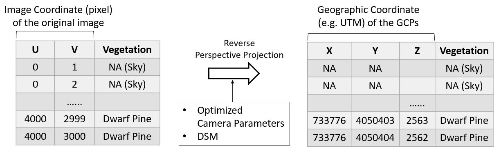

```{r setup, include=FALSE}
library(tidyverse)
library(magrittr)
library(kableExtra)
library(tidyverse)
library(magrittr)
library(fs)
library(lubridate)
```

# Introduction

The effects of climate change on terrestrial ecosystems are particularly significant in alpine regions (\cite{IPCC2007}). Alpine vegetation depends on severe conditions such as low temperatures and long snow-covered periods. Thus alpine areas have rare and unique species adapted to the extreme environments. Several studies have reported that recent global climatic changes, e.g., increasing temperatures and reducing snow-covered periods, have accelerated the invasion of non-native species into alpine areas (see \cite{Alexander2016AlpBotany}). In Japan, dwarf bamboo (*Sasa kurilensis*) has invaded alpine snow meadows, probably driven by the extension of the snow-free period (\cite{Kudo2011EcoEvo}). Also, climate change has affected the growth and phenologies of native species. For example, the growth of dwarf pine (*Pinus pumila*), a dominant species in Japanese alpine regions, has been affected by climatic conditions such as temperature and snowmelt (\cite{Amagai2015EcoRes}). Effective conservation planning requires constant monitoring of vegetation distribution to detect such changes. Also, since the impact of climate change on alpine vegetation varies depending on species and the microhabitats (\cite{Kudo2010AAA}), spatially high-resolution monitoring with a wide range is required.

Previous studies have mainly depended on field observations, yet it is hard to cover broad areas in alpine regions due to the poor accessibility and severe weather. Satellite, airborne, and Unmanned Aerial Vehicle (UAV) remote sensing methods are alternatives. However, satellite imagery of alpine areas is rarely available due to cloud cover, and the spatial resolution is not enough to observe vegetation changes at the plant community scale. Airborne imagery can obtain high-resolution data, but its cost becomes a bottleneck for frequent monitoring. Although UAV methods have become a cost-effective tool for ecological monitoring (\cite{Baena2017PLOSONE}), operating UAVs in alpine regions is challenging due to the strong wind and harsh topology.

On the other hand, researchers have also utilized automated digital time-lapse cameras mounted on the ground for monitoring green-leaf phenologies in forests (\cite{Richardson2009EcolAppl}), grasslands (\cite{Browning2017RemSen}), and alpine meadows (\cite{IdeOguma2013EcolInfom}). Unlike satellite imagery, ground-based cameras provide images free of clouds and atmospheric effects. Also, they can obtain high-resolution (i.e., sub-meter scale) and frequent (i.e., daily or hourly) images at a meager cost. These studies set some regions of interest (ROI) in the images and calculate the phenology index (e.g., excess greenness, \cite{Woebbecke1995ASAE}). However, few studies have utilized such images in monitoring vegetation distributions. This lack of studies seems to be because applying such time-lapse imagery in monitoring vegetation distribution has two technical challenges.

First, unlike satellites' multispectral sensors, ordinal digital cameras can only obtain three bands (Red, Green, and Blue), making it harder to classify the vegetation. Second, since digital time-lapse cameras are mounted on the ground, transforming these images into geospatial data (e.g., orthoimage) is challenging. In other words, even if we classify the vegetation from such images, we cannot quantitatively measure and analyze it as geographic data. It is essential to treat ground-based images as geographic data to utilize them in conservation planning.

This study proposes an automated method for drawing vegetation maps with a digital time-lapse camera by solving these two challenges. We solved the first challenge by using time-lapse images to classify vegetation. Since the autumn leaf phenology varies among species, we utilized that information. We show the effectiveness of such phenological information in vegetation classification. We also developed a novel method for transforming a ground-based photograph into geographic data to tackle the second challenge. Finally, we show an example of a vegetation map drawn by the proposed method. We aim to use cheap but powerful digital time-lapse cameras in alpine ecosystem monitoring and conservation.

# Materials and methods

## Digital time-lapse camera imagery

We used time-lapse images of a Japanese alpine region owned by the National Institute for Environmental Studies, Japan (NIES). All the images are publically available on NIES' webpage (https://db.cger.nies.go.jp/gem/ja/mountain/station.html?id=2). In 2010, NIES installed the digital time-lapse camera (EOS 5D MK2, Canon Inc., 21 M pixels) on a mountain lodge Murodo-sanso (about 2350 m a.s.l., above the forest limit), located at the foot of Mt. Tateyama (3015 m a.s.l.), in the Nothern Japanese Alps (Fig. \ref{fig:map}). The camera takes a photograph per hour, from 6 a.m. to 7 p.m. . The camera's field of view (FOV) includes Mt. Tateyama, which ranges from about 2350 m a.s.l. to 3015 m a.s.l. in elevation. The area has a complex mosaic-like vegetation structure because of its topography, including rocks, cliffs, curls, and moraines. From April to November, the camera observed the snowmelt and seasonal phenology of evergreen(e.g., *Pinus pumila*) and deciduous (*Sorbus* sp.,  *Betula ermanii*) dwarf trees, dwarf bamboos (e.g., *Sasa kurilensis*), and alpine shrubs and herbaceous plants (e.g., *Geum pentapetalum*, *Nephrophyllidium crista-galli*). This study used images from the summer and fall of 2015 to classify vegetation with the temporal patterns of the leaf color.

(ref:map) The study site. (a) The location of Mt. Tateyama. (b) The installation point of the camera in Murodo-sanso lodge. (c) The camera (EOS 5D MK2, Canon Inc.)

```{r, map, echo=FALSE, message=FALSE, fig.cap="(ref:map)", out.width="100%", auto_pdf = TRUE}
# map('japan', xlim = c(127,148), ylim = c(30,47))
# map.axes()
# points(137.618973, 36.574844, col="red",pch=20)
# text(133.5, 38,"Mt. Tateyama",col="red")
knitr::include_graphics("paper_files/figures/Slide3.jpg")
```

## Preprocessing

### Selecting images

First, we selected images. We choose seven days with good weather from late summer to late fall of 2015 (8/25, 9/5, 9/12, 9/20, 9/26, 10/3, 10/10). The temporal patterns of autumn foliage coloration are largely different among species (see Fig. \ref{fig:pixtimeseries}). Our method utilizes this information in the vegetation classification. Time-lapse cameras are particularly good at observing such temporal changes of the vegetation, while UAVs and airborne imagery cost much.

### Automatic image-to-image alignment

Although the camera is fixed on the mountain lodge, the images are slightly misalighned do to the wind. To handle this issue, we aligned the images before processing using Python3 programming language and OpenCV4 (https://opencv.org/) image processing library. First, one image of 2015 were set as the alignment target. Next, we automatically matched key points between the target and other images using the AKAZE local feature extractor (\cite{Alcantarilla2013AKAZE}) and K-nearest neighbor matcher. Then, we searched and applied the homography matrix that minimizes the distance between each pair of the matching points, using OpenCV's "findHomography" function. Applying the estimated homography matrix, we could align the images accurately (0.654 pixels in root mean square error (RMSE) of the matching points). Finally, an input mask were applied to define image regions that should be ignored in the following procedure, such as the sky and the regions too close to the camera. This process ensures that a set of pixel time-series reflects a phenological information of a same location, which is essential in the vegetation classification process.

## Automatic vegetation classification

Because the images were aligned succesfuly, we can stack the images and extract a time series of pixel values (Red, Green, and Blue, Fig. \ref{fig:pixtimeseries}) for each pixel. Such pixel time series reflects the temporal patterns of leaf colors. Because deciduous plants have great differences in autumn leaf phenology among species, researchers have used that information for vegetation classification with satellite imagery (\cite{Tigges2013RemSenEnv}, \cite{Son2013RemSen}, \cite{Heupel2018PFG}). However, no research has applied this technique to ground-based time-lapse imagery. We implemented Support Vector Machine (SVM) and Recurrent Neural Network (RNN) based vegetation classifiers, and tested the effects of using pixel time series of the ground-based imagery on the classification performance.

(ref:pixtimeseries) Pixel time series acquired from the time-lapse camera. You can obtain a time series of pixel values (i.e., Red, Green, and Blue) for each pixel on the photographs. Such pixel time series reflects the autumn phenology of the vegetation.

```{r, pixtimeseries, echo=FALSE, message=FALSE, fig.cap="(ref:pixtimeseries)", out.width="100%", auto_pdf = TRUE}
knitr::include_graphics("paper_files/figures/Slide1.jpg")
```

### Model Architecture

We prepared two supervised models, SVM and RNN, to classify the pixel time series into vegetation categories. SVM is one of the most popular machine learning models in remote sensing and has many applications (\cite{Mountrakis2011SVMReview}), including vegetation classification with multitemporal satellite imagery (\cite{Tigges2013RemSenEnv}). RNN is a neural network that recognizes temporal or sequential data dynamics. Researchers have also utilized RNN for remote sensing tasks, such as land cover classification, with multi-temporal satellite imagery (\cite{Ienco2017RemSenLSTM}, \cite{Sharma2018NN}). \cite{Ienco2017RemSenLSTM} reported that an RNN classifier outperforms an SVM classifier. Amongst many variants of RNN, we used Long Short Time Memory (LSTM, \cite{Hochreiter1997LSTM}), one of the most well-known RNN architectures. Batch-normalization technique (\cite{IoffeSzegedy2015BatchNorm}) was employed to speed up and stabilize the model training. We also classified the pixel of every single image separately using SVM classifiers to test whether using multi-temporal imagery improves the classification performance.

### Dataset preparation

We set 7 vegetation classes: Dwarf Pine (*Pinus pumila*), Dwarf Bamboo (*Sasa kurilensis*), Rowans (*Sorbus sambucifolia*, *Sorbus matsumurana*), Birch (*Betula ermanii*), Alder (*Alnus viridis* subsp. *maximowiczii*), Other Vegetations (such as alpine shrubs and herbaceous plants), and No Vegetation. Using an open-source image annotation software (Semantic Segmentation Editor, Hitachi, https://github.com/Hitachi-Automotive-And-Industry-Lab/semantic-segmentation-editor), an expert prepared a teacher dataset for each class. Then we validated the teacher dataset with a set of telephotos taken in the summer and fall of 2016.

### Implementation and model training

We implemented the classifier with Python3 language, ThunderSVM library (<https://github.com/Xtra-Computing/thundersvm>) for the SVM classifier, and  PyTorch deep neural network library (<https://pytorch.org/>) for the RNN classifier. All source codes are publically available via GitHub (<https://github.com/0kam/VegetationMapPaper>).

## Automatic georectification

Then, we developed a novel method to convert ground-based landscape imagery into geographical data. This process is called georectification. Georectification of ground-based images has been a difficult task, and this causes the underuse of potentially rich information in ground-based imagery. In plain words, georectification means aligning images onto Digital Surface Models (DSMs) so that every pixel of an image gets a geographical coordinate. You can do this by modeling the camera. A camera is considered a function that transforms 3D geographical coordinates (e.g., X, Y, and height in a Universal Transverse Mercator coordinate system (UTM)) into 2D image coordinates (locations of each pixel in the image). Estimating the parameters of this function (such as the camera location, pose, and the FoV), you can simulate how each point of the DSM appears in the image. Usually, georectification has three steps:

1.  Finding Ground Control Points (GCPs) in the image.\
2.  Estimating the camera parameters such as camera poses and FoV using GCPs.\
3.  Projecting the DSM into the image using the camera parameters.

Recently, researchers have developed some georectification methods to use ground-based photographs in glaciology (\cite{Messerli2015GeoInst}) and snow cover studies (\cite{Portenier2020Cryosphere}). Especially, \cite{Portenier2020Cryosphere} is worth mentioning for its semi-automatic method using mountain silhouettes as GCPs since setting GCPs in alpine region is not easy. However, this silhouette-based method has a drawback in the projection accuracy. It only uses limited areas (silhouettes) of images in the GCP acquisition, and also it ignores lens distortion. Because our target site has a complex vegetation distribution and our camera has considerable lens distortion, we needed a more accurate method.

## Modeling and estimating camera parameters

As we mentioned before, we modeled a camera as a function that transforms the geographical coordinates of the target mountain into the image coordinates in the acquired image. We implemented this procedure using the OpenGL framework (<https://www.opengl.org/>) to accelerate it with graphical processing units (GPUs). In OpenGL, we can divide this process into three operations:

1. Transforming the world (geographical) coordinates to the view coordinates (coordinates seen from the camera's point of view) using the camera's extrinsic parameters (i.e., the location and angles of the camera). \
2. Distorting the view coordinates using the lens distortion parameters. \
3. Transforming the view coordinates to the screen (image) coordinates using the camera's intrinsic parameters (i.e., the FoV of the camera).

First, we transformed the absolute geographic coordinates (also known as the world coordinates) into the view coordinates relative to the camera's position and direction. We applied a $4 \times 4$ view matrix $M_{view}$ (\ref{view_matrix}) to the geographic coordinates in this step. The view matrix represents the camera's position and direction (pan, tilt, roll). The geographic coordinate system must be cartesian (such as the UTM coordinate systems).

```{=tex}
\begin{equation}
\label{view_matrix}
  M_{view} = 
  \begin{bmatrix}
    \cos roll & -\sin roll & 0 & 0 \\
    \sin roll & \cos roll & 0 & 0 \\
    0 & 0 & 1 & 0 \\
    0 & 0 & 0 & 1 \\
  \end{bmatrix}
  \begin{bmatrix}
    1 & 0 & 0 & 0 \\
    0 & \cos tilt & -\sin tilt & 0 \\
    0 & \sin tilt & \cos tilt & 0 \\
    0 & 0 & 0 & 1 \\
  \end{bmatrix}
  \begin{bmatrix}
    \cos pan & 0 & \sin pan & 0 \\
    0 & 1 & 0 & 0 \\
    -\sin pan & 0 & \cos pan & 0 \\
    0 & 0 & 0 & 1 \\
  \end{bmatrix}
  \begin{bmatrix}
    1 & 0 & 0 & -x \\
    0 & 1 & 0 & -z \\
    0 & 0 & 1 & -y \\
    0& 0 & 0 & 1 \\
  \end{bmatrix}
\end{equation}
```

Where $pan, tilt, roll$ are the Euler angles of the camera pose and $x, y, z$ are the camera location in the geographic coordinate system. Then, we can transform the geographic coordinates of the DSM $\begin{bmatrix} X_{geo} & Z_{geo} & Y_{geo} & 1 \end{bmatrix}$ to the view coordinates $\begin{bmatrix} X_{view} & Z_{view} & Y_{view} & 1 \end{bmatrix}$ applying the view matrix $M_{view}$ (\ref{view_tf}). In the OpenGL's view coordinate system, $X_{view}$, $Z_{view}$ and $Y_{view}$ represents horizontal, vertical, and depth positions respectively.

```{=tex}
\begin{equation}
\label{view_tf}
  \begin{bmatrix} 
    X_{view} \\ Z_{view} \\ Y_{view} \\ 1 
  \end{bmatrix}
  =
  M_{view}
  \begin{bmatrix} 
    X_{geo} \\ Z_{geo} \\ Y_{geo} \\ 1 
  \end{bmatrix}
\end{equation}
```

Second, we distorted the camera coordinates to simulate the lens distortion. We modeled the lens distortion (\ref{dist_model}) based on \cite{Weng1992CameraCalib} and OpenCV's implementation (<https://docs.opencv.org/4.x/d9/d0c/group__calib3d.html>), where $X_{norm}$ and $Z_{norm}$ are the $Y$-normalized view coordinates. This model distorts points' locations according to the distance from the center of the image when projected to the image surface. Our model includes radial ($k1$~$k6$), tangental ($p1$, $p2$), thin prism ($s1$~$s4$) distortion, and unequal pixel aspect ratio ($a1$, $a2$). See \cite{Weng1992CameraCalib} for the details of lens distortion modeling. 

```{=tex}
\begin{gather}
\label{dist_model}
  \begin{gathered}
  X_{norm} = \frac{X_{camera}}{Y_{camera}} \\
  Z_{norm} = \frac{Z_{camera}}{Y_{camera}} \\
  r^2 = {X_{norm}}^2 + {Z_{norm}}^2 \\
  \begin{bmatrix}
    X_{dist\_norm} \\ 
    Z_{dist\_norm} \\
  \end{bmatrix} 
  = 
  \begin{bmatrix} 
    X_{norm} \frac{1 + k_1 r^2 + k_2 r^4 + k_3 r^6}{1 + k_4 r^2 + k_5 r^4 + k_6 r^6} + 2 p_1 x’ y’ + p_2(r^2 + 2 x’^2) + s_1 r^2 + s_2 r^4 \\ 
    Z_{norm} \frac{1 + a_1 + k_1 r^2 + k_2 r^4 + k_3 r^6}{1 + a_2 + k_4 r^2 + k_5 r^4 + k_6 r^6} + p_1 (r^2 + 2 y’^2) + 2 p_2 x’ y’ + s_3 r^2 + s_4 r^4 \\    \end{bmatrix} \\
  X_{dist} = X_{dist\_norm} Y_{camera} \\
  Z_{dist} = Z_{dist\_norm} Y_{camera} \\
  \end{gathered}
\end{gather}
```

Next, we transformed the distorted view coordinates to the image coordinates by perspective projection. During the perspective projection, a closer object is drawn larger. We used a $4 \times 4$ projection matrix $M_{proj}$ (\ref{proj_mat}), that represents the camera's horizontal ($fov_x$) and vertical ($fov_z$) FoV. Finally, we can get the image coordinates of the points as $X_{image}, Z_{image}$ (\ref{proj_tf}).

```{=tex}
\begin{gather}
\label{proj_mat}
  \begin{gathered}
  f_x = \frac{1}{\frac{\tan fov_x}{2}} \\
  f_z = \frac{1}{\frac{\tan fov_z}{2}} \\
  M_{proj} = 
  \begin{bmatrix} 
    f_x & 0 & 1 & 0\\ 
    0 & f_z & -1 & 0 \\ 
    0 & 0 & 0 & 1\\ 
    0 & 0 & -1 & 0 
  \end{bmatrix}
  \end{gathered}
\end{gather}
```

```{=tex}
\begin{equation}
\label{proj_tf}
  \begin{bmatrix} 
    X_{image} \\ Z_{image} \\ Y_{image} \\ 1 
  \end{bmatrix}
  =
  M_{proj}
  \begin{bmatrix} 
    X_{dist} \\ Z_{dist} \\ Y_{dist} \\ 1 
  \end{bmatrix}
\end{equation}
```

Applying these procedures to the GCPs' geographical coordinates, we can calculate the reprojected image coordinates with a set of camera parameters (the camera location, pose, FoV, and lens distortion parameters). Then, we can measure the distance from the actual image coordinates of GCPs ($U, V$ of Fig. \ref{fig:optim}) to the reprojected image coordinates ($U', V'$ of Fig. \ref{fig:optim}). We estimated the camera parameters (except camera location) by minimizing this distance using the Covariance Matrix Adaptation Evolution Strategy (CMA-ES, \cite{Hansen2003CMAES}, Fig. \ref{fig:optim}). We could not estimate the camera location because it makes the problem too complicated (e.g., a telephoto taken from a distance and a wide-angle taken from a close look similar).

(ref:optim) Workflow of the camera parameter optimization. We estimated the camera parameters by minimizing the GCP's reprojection error.

```{r, optim, echo=FALSE, message=FALSE, fig.cap="(ref:optim)", out.width="100%", auto_pdf = TRUE}

```

## Image-matching-based aqcuisition of GCPs

Usually, GNSS-positioned GCPs (such as GCP markers) are set before photo acquisition to get a georeferenced image, however, setting such markers in alpine areas are often tough due to the harsh topology. \cite{Portenier2020Cryosphere} solved this problem by developing a method that uses mountain silhouettes to match images and DEMs. Its weak point is that the georectification accuracy is sometimes low in the mountainside, where no GCPs are set. We developed an novel method that uses  an orthorectified airborne image to get matching points between images and DSMs in a broader area. 

First, an airborne image and a DSM that covers the camera's field of view, and a set of initial camera parameters (roughly estimated camera parameters) were prepared. We rendered a simulated landscape image by applying the camera model to these. Since the simulated image is consists of georeferenced DEM and airborne image, every pixel has a geographic coordinate. Then we searched matching points between the original image and the simulated image using AKAZE local feature matcher  (Fig. \ref{fig:matched}). Since these matching points have both geographical coordinates (from the DSM) and image coordinates (from the original image), we used these points as GCPs. This method enables us to acquire GCPs in much broader area than the previous method. Our procedure requires the camera's exact location and initial camera parameters to render the simulated image. Note that the orthorectification accuracy of the airborne image may affect the georectification accuracy.

(ref:matched) The original image (left) and the simulated image (right). The simulated image was rendered with an orthophoto, DSM, and initial camera parameters. Red points show the matching points found by the AKAZE local feature matcher. We used these points as GCPs.

```{r, matched, echo=FALSE, message=FALSE, fig.cap="(ref:matched)", out.width="100%", auto_pdf = TRUE}
knitr::include_graphics("paper_files/figures/Slide4.jpg")
```

## Georectification of the vegetation map
(ref:georec) Our georectification procedure. We applied the optimized camera parameters to the DSM and the vegetation classification result to get a vegetation map. 

```{r, georec, echo=FALSE, message=FALSE, fig.cap="(ref:georec)", out.width="100%", auto_pdf = TRUE}

```

Finally, we georectified the vegetation classification result using the optimized camera parameters (Fig. \ref{fig:georec}). At this point, we got the point data of vegetation (as shown in the table on the right of Fig. \ref{fig:georec}) that every row represents a pixel of the original image. To measure the area of each vegetation class, we converted the point data to raster data. We rasterized the point data in 1 m resolution, then interpolated holes up to 2 m since the maximum pixel footprint was about 2 m on the ridge of the mountain. We implemented these procedure using R language \cite{RCore}, `stars` package \cite{Rstars} and `terra` \cite{Rterra} package. See <https://github.com/0kam/VegetationMapPaper/blob/master/scripts/utils/interpolate.R> for the source code.

## Implementation and data set

We implemented the algorithm with Python3 language and published it as an open-source package via GitHub (<https://github.com/0kam/alproj>). We used an airborne photograph taken in the October of 2014 with a spatial resolution of 1.0 m. Also, we used the 1m resolution Digital Surface Model that was also used in the orthorectification process of the airborne photograph.

# Results

## Vegetation classification accuracy

We evaluated the performance of the vegetation classifier using a 5-fold cross-validation design. Each fold was stratified with the vegetation categories. We used F1-score, a standard metric in machine learning evaluation (\ref{metrics}), where $TP, FP, FN$ is true positives, false positives, and false negatives, respectively.

```{=tex}
\begin{align}
\label{metrics}
  \begin{gathered}
  precision = \frac{TP}{TP + FP} \\
  recall = \frac{TP}{TP + FN} \\
  F_1 = \frac{2 \cdot precision \cdot recall}{precision + recall} \\
  \end{gathered}
\end{align}
```

(ref:vegeacc) F1-scores of vegetation classification. F1-score was calculated for each vegetation class. Each box shows the results of a 5-fold cross-validation. We classified vegetation using a single image (shown as the shooting date) with SVM classifiers and all images with SVM (shown as "Multidays") and RNN (shown as "Multidays RNN") classifiers.

```{r, vegeacc, echo=FALSE, message=FALSE, fig.cap="(ref:vegeacc)", out.width="100%", auto_pdf = TRUE}
knitr::include_graphics("../results/cv.png")
```

(ref:vegetation) Left: Vegetation classification results of the RNN model. The masked area, i.e., the sky and the regions too close to the camera, is shown in black. Right: The generated vegetation map. The background shows contour lines. 

```{r, vegetation, echo=FALSE, message=FALSE, fig.cap="(ref:vegetation)", out.width="100%", auto_pdf = TRUE}
knitr::include_graphics("paper_files/figures/vege.png")
```

Fig. \ref{fig:vegeacc} shows the results of the 5-fold cross-validation. Focusing on the single image classification (shown as the shooting date), the best date for classification was different among classes. For example, 26th Sep was the best for identifying rowans, but 10th Oct was for dwarf pines and dwarf bamboos. Note that the autumn colorization of rowan leaves was at best on 26th Sep, and the most vegetation except dwarf bamboo and dwarf pine were blasted on 10th Oct. No single image can classify birch and montane alder accurately. In contrast, using all images (shown as "Multidays" and "Multidays RNN" representing the SVM and RNN classifiers, respectively) resulted in a high F1 score in every class. Also, the RNN classifier outperforms the SVM classifier (0.937 and 0.918 in macro average F1 score). Fig. \ref{fig:vegetation} (left) shows the products of the RNN classifier. We can observe the distribution of each vegetation classes at the plant-community scale.

## Georectification accuracy
We tested our georectification method's accuracy and evaluated its two features' effects: using the simulated image and image matching to acquire GCPs, and modeling the lens distortion. We manually searched 83 matching points between the simulated and original images and treated them as the test GCPs: GCPs that are not used in the georectification process. We additionally prepared two comparison methods to test the performance of the proposed method. The first one is the silhouette-based matching method (after this called silhouette) used in previous studies (\cite{Portenier2020Cryosphere}). The second is the proposed method without the lens distortion model (after this called no distortion). We evaluated the projection error of the test GCPs using these three methods. The proposed method achieves accurate projection (3.45 m as the root mean square error) while the other two did not (16.1 m with silhouette, 23.6 m with no distortion). We estimated the lens distortion parameters in the silhouette method. Fig. \ref{fig:geoacc} shows the relationship between the projection error of the proposed method and the test GCPs' distance from the shooting point. The projection error was especially large in the GCPs near the shooting point. Note that the projection errors were measured ignoring the georectification error of the orthophoto and the DSM. Fig. \ref{fig:vegetation} (right) shows the produced vegetation map. The vegetation map has missing areas because ridges blocked the camera's view.

(ref:geoacc) The projection error of the proposed method. The projection error was particularly large in the area near the camera.

```{r, geoacc, echo=FALSE, message=FALSE, fig.cap="(ref:geoacc)", out.width="100%", auto_pdf = TRUE}

```

# Discussion

We suggested a fully automated procedure to transform time-lapse images of an alpine region into a georeferenced vegetation map at a meager cost. This task is challenging because of 1. the difficulty of classifying vegetation with ordinal digital camera imagery and 2. the difficulty of georectification of such ground-based imagery. We solved these issues by 1. using the temporal information of autumn leaf colors for vegetation classification and 2. developing a novel method for accurate image georectification. The proposed methods reached a functional performance (0.937 in a mean F1 Score of vegetation classification, 3.4 m in a mean projection error of georectification) to use the vegetation map in monitoring the vegetation distributions on a plant-community scale.

## The benefit of using time-series imagery for vegetation classification

One of the shortcomings of ordinal digital cameras is that they only have three bands (Red, Blue, and Green). We made up for this lack of information using the rich temporal information that time-lapse cameras can obtain. Many plant species have characteristic phenologies, such as autumn foliage, and the suitable season to observe them differs among species. The result (Fig. \ref{fig:vegeacc}) shows that each vegetation class has its suitable timing to identify it in photographs. Classifying multiple vegetation classes requires long-term (such as several months long) and frequent (such as daily) monitoring, and digital time-lapse cameras are suitable. In addition, combining multi-temporal images improved the classification accuracy, especially with Birch and Montane Alder (Fig. \ref{fig:vegeacc}). The best F1 score was low with single image classification (0.750 for Montane Alder, 0.345 for Birch), and using multi-temporal images improves them much (0.951 and 0.781 with the SVM classifier). This result shows that identifying these vegetation requires multi-temporal information. The inter-community heterogeneity of autumn foliage timing in these species may cause this result. As the previous study pointed out (\cite{Ienco2017RemSenLSTM}), the RNN model outperformed the SVM model, particularly in identifying Birch (0.781 with SVM and 0.831 with RNN). Our model can still be further improved. As \cite{Sharma2018NN} claimed, the patch-based classification method may improve the performance. Such patch-based models take a time series of small patches as an input to utilize the spatial information, such as textures, in the classification process.

## The performance of the georectification method and its limitation.

The most significant barrier to using ground-based imagery in ecological monitoring is its difficulty in treating it as geospatial data. An automated and accurate georectification method was required to overcome this challenge. Without georectification, we cannot quantitatively analyze (e.g., measuring the area, locating the place, and analyzing with topographic data) the acquired information, such as the vegetation distribution. We suggested a novel method to georectify such imagery. With minimal manual user inputs (i.e., the location of the camera and the initial camera parameters), our method achieved a state-of-the-art accuracy (3.45 m). We tested the effectiveness of the two features of our method: the lens distortion model and the image-matching-based method to acquire GCPs automatically. The results show that the lens distortion model greatly improved the georectification accuracy. Without the lens distortion model, our model resulted in a projection accuracy of 23.6 m. However, since the effect of lens distortion on the georectification accuracy is different among cameras and lenses (\cite{Portenier2020Cryosphere}), further testing will be required to ensure the advantage of our lens distortion model. Note that the proposed lens distortion model does not support a fisheye lens and omnidirectional camera. Another feature of our method is the automatic acquisition of GCPs using simulated images and image matching techniques. This method requires a high-resolution orthophoto that covers the camera's field of view. This costs a bit; however, the reward is considerable. Using simulated images in GCP acquisition also improved the georectification accuracy; the conventional silhouette-based method resulted in an RMSE of 16.1 m. This result suggests that acquiring matching points between the image and the DSM in a broader area benefits the camera parameter estimation process. However, the proposed method (AKAZE image matcher) could not acquire matching points in the area near the camera, and the projection error was relatively large (Fig. \ref{fig:geoacc}). While the spatial resolution of the simulated image depends on orthophoto (in this study, 1 m), that of the original image changes depending on the distance from the camera. In such near areas, the spatial resolution of the original image is much higher than that of the simulated image, and the image matcher cannot handle the difference. Recently, researchers have developed some deep-learning-based image-matching methods (e.g., \cite{Yang2018ImageMatching}, \cite{Wu2013AEImageMatching}) that are more robust to the differences in image sources and viewpoints. Applying these methods to the GCP acquiring process may improve the performance of our method, especially in near areas. Theoretically, our approach can handle the images of other ecosystems, such as forests. However, because the georectification accuracy strongly depends on the accuracy of the DSM, this may be difficult. Since alpine plants tend to be very short, readily available Digital Elevation Models (DEMs) can be used as the DSMs. In forestry areas, vegetation height is considerable, and the gap between the DEMs and the actual surface (top of the forest) will cause significant errors in the georectification process.

## Future application and conclusion
Here, we proposed an automated method to draw a vegetation map from a series of images acquired by a digital time-lapse camera. The produced vegetation map has sufficient accuracy for monitoring endemic and vulnerable alpine vegetation. One of the benefits of digital time-lapse cameras is their long-term operability. Applying the proposed method to the existing long-term time-lapse imagery will enable the researchers to quantitatively understand the vegetation changes and their trends. That information will help plan the field observations and conservation activities more effectively. Our methods facilitate cost-efficient monitoring of alpine vegetation and understanding of the progressing impacts of climate changes on alpine ecosystems.